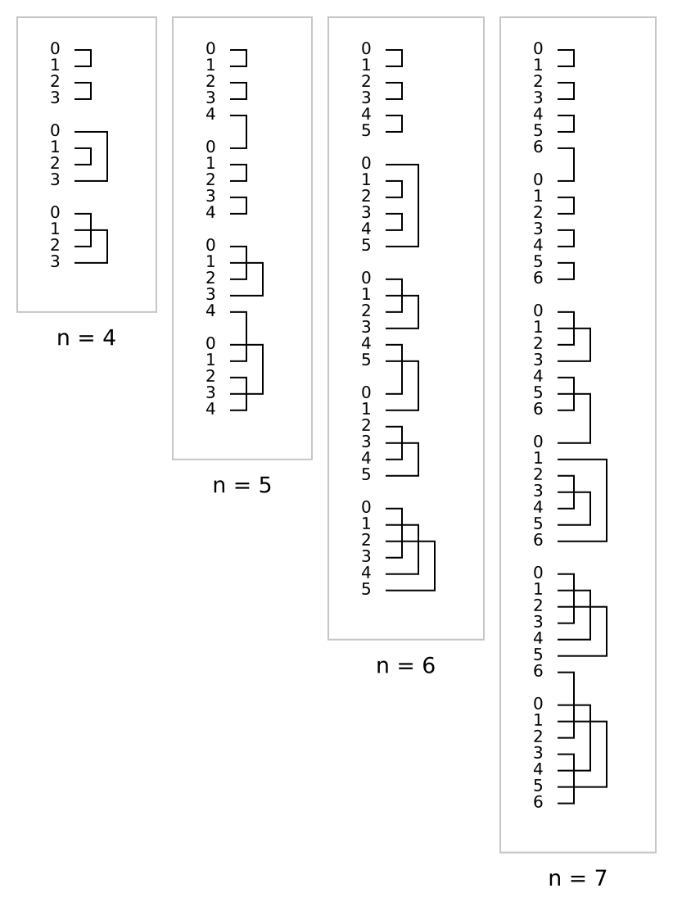

# xbar

Rust implementation of the algorithm described in the conference paper _"[A locality preserving one-sided binary tree - crossbar switch wiring design algorithm](https://ieeexplore.ieee.org/document/7086839)"_ published in [2015 49th Annual Conference on Information Sciences and Systems (CISS)](https://ieeexplore.ieee.org/xpl/mostRecentIssue.jsp?punumber=7075844).



> __One-sided crossbar switches__ allow for a simple implementation of complete `K_n` graphs. However, designing these circuits is a cumbersome process and can be automated.
> We present an algorithm that allows designing automatic one-sided binary tree - crossbar switches which __do not exceed `floor(n/2)` columns__, and achieves `K_n` graph without connecting any wires between any three adjacent blocks, thus preserving locality in connections.

- Slides of the conference presentation are provided [here](presentation.pdf).
- Paper that contains the pseudocode and mathematical proof is provided [here](paper.pdf).

__I had previously implemented [this algorithm in Java](https://gitlab.com/kubuzetto/crossbarWiring).__ The original paper simply _proves_ that the output can be fit into `floor(n/2)` columns, but does not provide a way to 'pack' connections into that many columns. In the Java code, the part that handles the packing is quite dirty and was not suitable for iterator-based implementations. I spent some time on how to implement packing efficiently for this implementation and managed to boil down the entire thing into very simple and elegant mathematical expressions.

## What can be done with this?

Algorithms like this used to be useful in circuit switching. Frankly, I don't think that this crate will be used by anyone in 2019 and beyond.

## Usage

### Simple example

```rust
extern crate xbar;
use xbar::Crossbar as X;
pub fn main() {
	let n = 5;
	println!("Crossbar for {} terminals has {} rows, \
		formed into {} blocks; and {} columns",
		n, X::rows(n), X::blocks(n), X::columns(n));
	println!("Connections of the crossbar:");
    for con in X::new(n) {
		println!("{:#?}", con);
    }
}
```
produces the output:
```text
Crossbar for 5 terminals has 20 rows, formed into 4 blocks; and 2 columns
Connections of the crossbar:
Connection {
    start: Position {
        block_idx: 0,
        row_idx: 0,
        abs_idx: 0
    },
    end: Position {
        block_idx: 0,
        row_idx: 1,
        abs_idx: 1
    },
    col_idx: 0
}
...
```

### SVG output

A more sophisticated example that generates `.svg` images is present in the `examples/` directory. You can execute it as follows:

```sh
cargo run --example svg_test -- --output test.svg --num_terms 15
```

# Reference

Sahin, Devrim. "A locality preserving one-sided binary tree - crossbar switch wiring design algorithm." _Information Sciences and Systems (CISS), 2015 49th Annual Conference on_. IEEE, 2015.

## Bibtex
```tex
@inproceedings{dsahin2015crossbar,
  title={A locality preserving one-sided binary tree - crossbar switch wiring design algorithm},
  author={{\c{S}}ahin, Devrim},
  booktitle={Information Sciences and Systems (CISS), 2015 49th Annual Conference on},
  pages={1--4},
  year={2015},
  organization={IEEE}
}
```

# License
GPLv3.

